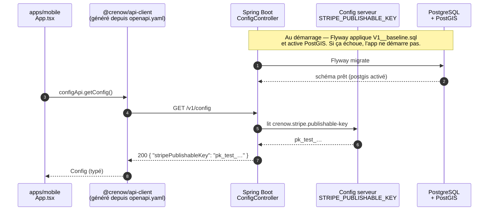
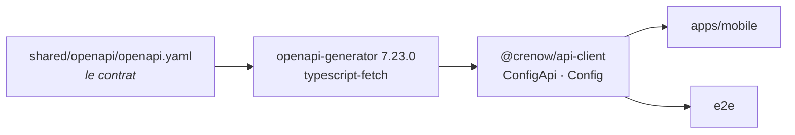
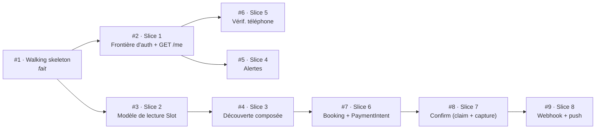

# Slice 0 — Walking skeleton : monorepo + backend + pipeline OpenAPI→TS

> Debrief de l'issue [#1](https://github.com/MaximeD1412/crenow/issues/1) — PR [#10](https://github.com/MaximeD1412/crenow/pull/10).

Une seule requête, `GET /config`, qui traverse **toutes** les couches : le monorepo, Gradle, Spring Boot,
PostgreSQL + Flyway + PostGIS, la spec OpenAPI, le client TS généré, et l'app Expo. Aucune logique métier —
juste la preuve que la chaîne tient debout.

---

## Les 5 critères d'acceptation

Tous vérifiés par des tests qui échouent si la condition disparaît — pas par constatation visuelle.

| | Critère | Preuve |
|---|---|---|
| ✅ | Le monorepo suit l'**ADR 0007** (`apps/mobile`, `backend/`, `shared/openapi`) avec orchestration à la racine | Gradle + pnpm/Turbo cohabitent |
| ✅ | Spring Boot démarre sur PostgreSQL, **Flyway** joue une migration baseline, **PostGIS** est activé | `ConfigEndpointIT.flywayRanAndPostgisIsEnabled` |
| ✅ | **springdoc** sert la spec sur `/v1/v3/api-docs` | `ConfigEndpointIT.springdocServesSpecIncludingConfigPath` |
| ✅ | Le **client TS est généré** depuis `shared/openapi` et **consommable par le mobile** | `apps/mobile` importe `@crenow/api-client` et typecheck |
| ✅ | `GET /config` renvoie `stripePublishableKey` (public, sans auth), **exercé via le client généré** | `e2e/src/smoke.test.ts` |

---

## Trois décisions, prises avec le fondateur (HITL)

Le ticket était marqué **HITL** : « décisions architecturales qui méritent un œil humain ». Ces trois-là fuient
dans les trois codebases et sont coûteuses à revenir dessus — elles n'ont donc pas été prises seul.

| Sujet | Retenu | Écarté |
|---|---|---|
| **Base de données (tests)** | Docker + Testcontainers | Postgres embarqué (zonky), Postgres managé (Neon) |
| **Périmètre mobile** | Scaffold Expo + E2E Node | App Expo complète sur simulateur |
| **Générateur TS** | `openapi-generator-cli` (typescript-fetch) | `openapi-typescript` + `openapi-fetch` |

---

## Forme du repo (ADR 0007)

Deux chaînes de build cohabitent : **Gradle** pour le backend, **pnpm + Turbo** pour le TS. Turbo connaît
l'ordre (`generate` → `build` → `typecheck`), donc le client est toujours à jour avant que quoi que ce soit
ne le consomme.

```
backend/                      Java 25 · Spring Boot 4.0.7 · wrapper Gradle 9.6.1
  ├── build.gradle.kts
  ├── gradlew                 ← wrapper versionné, pas de Gradle global requis
  └── src/
      ├── main/java/com/crenow/
      │   ├── CrenowApplication.java
      │   └── config/ConfigController.java      GET /config
      ├── main/resources/
      │   ├── application.yml                   context-path: /v1
      │   └── db/migration/V1__baseline.sql     CREATE EXTENSION postgis
      └── test/java/.../ConfigEndpointIT.java   Testcontainers

shared/openapi/               le contrat fait autorité (ADR 0013)
  ├── openapi.yaml            ← source de vérité, non modifié
  └── src/generated/          ← @crenow/api-client, gitignoré, régénéré

apps/mobile/                  Expo SDK 57 · RN 0.86 · React 19.2.3
  └── App.tsx                 importe @crenow/api-client

e2e/                          Vitest
  ├── src/globalSetup.ts      lance PostGIS + le jar backend
  └── src/smoke.test.ts       client généré → backend → /config

package.json · pnpm-workspace.yaml · turbo.json · docker-compose.yml
```

---

## Le trajet de la requête traceuse

C'est *la* raison d'être de la tranche : chaque flèche est une couche qui aurait pu être cassée et qui ne
l'est pas. Ce chemin est réellement parcouru par le test E2E à chaque exécution.



Quelques points que le schéma ne dit pas :

- **Étape 0 — la base.** Les slices géo (recherche `ST_DWithin`) se poseront sur l'extension PostGIS activée ici.
- **Aucun `fetch` à la main.** Le path, le nom de méthode et le type de retour viennent tous de la spec.
- **`/config` est public.** Spring Security n'est pas encore au classpath : la frontière d'auth est le boulot de
  la Slice 1 ([#2](https://github.com/MaximeD1412/crenow/issues/2)), délibérément.
- **La clé n'est jamais figée dans le bundle.** C'est tout l'intérêt de servir `/config` : rotation et bascule
  test ↔ live sans rebuild de l'app.

---

## La chaîne de génération (spec → TypeScript)

Le contrat est la source de vérité (**ADR 0013**). Le client n'est **pas versionné** : il est régénéré par Turbo.
Impossible qu'il dérive de la spec — et impossible de « corriger » le client à la main pour masquer un désaccord
avec le contrat.



---

## Deux choses que le scaffold a fait sortir

Les deux points qui méritent vraiment une relecture — le reste est de la plomberie conforme au plan.

### 1. Flyway ne tournait pas du tout

Spring Boot 4 a découpé l'auto-configuration en **modules par technologie**. Avoir `org.flywaydb:flyway-core`
au classpath **ne suffit plus** : sans `org.springframework.boot:spring-boot-flyway`, Flyway est présent mais
ne s'exécute jamais.

Le piège : **l'app démarrait très bien** et servait `/config` correctement. Rien n'était rouge. Seule
l'assertion qui interroge `flyway_schema_history` et `pg_extension` a révélé que la migration n'avait jamais
tourné et que PostGIS n'existait pas.

> Un test qui se serait contenté de « l'app répond 200 » aurait laissé passer ça — et la Slice 2 aurait buté
> dessus des semaines plus tard, sur les migrations géo.

Correctif : commit `d639af9`.

### 2. Collision de noms dans le client — réglée sans toucher à `openapi.yaml`

L'opération `searchSlots` est taguée `[Slots, Discovery]`. openapi-generator émet alors l'opération dans *les
deux* classes d'API, chacune exportant une interface `SearchSlotsRequest` — le barrel réexporte les deux, et
TypeScript refuse de compiler.

C'est un **artefact du générateur, pas un défaut du contrat**. Comme l'ADR 0013 traite la spec comme durable
(« coût de réversibilité élevé », les noms fuient dans trois codebases), le problème est réglé **au moment de
la génération**, via le normalizer `KEEP_ONLY_FIRST_TAG_IN_OPERATION` : `searchSlots` ne part que dans son
premier tag, `Slots`.

**`openapi.yaml` n'a pas été modifié d'une ligne.**

> **Arbitrage ouvert** : si le contrat lui-même ne doit porter qu'un tag, c'est un changement d'une ligne dans
> la spec et le normalizer saute.

---

## Frictions de version traversées

Des ruptures récentes, qu'on recroisera en écrivant les slices suivantes.

| Ce qui a cassé | Pourquoi | Réponse |
|---|---|---|
| **Testcontainers 2.0** | Artefacts renommés : `junit-jupiter` → `testcontainers-junit-jupiter`, idem `postgresql` | Nouvelles coordonnées ; versions gérées par le BOM Spring Boot |
| **`TestRestTemplate`** | Supprimé de Spring Boot 4 / Spring 7 | Remplacé par `RestTestClient` |
| **springdoc 2.x** | La ligne 2.x cible Spring Boot 3 | springdoc `3.0.3` (ligne Spring Boot 4) |
| **Auto-config Flyway** | Découpée en modules dans Spring Boot 4 | `spring-boot-flyway` ajouté |

---

## La stack

| Couche | Choix | Version |
|---|---|---|
| Langage backend | Java (LTS) | `25` |
| Framework | Spring Boot | `4.0.7` |
| Build backend | Gradle (wrapper) | `9.6.1` |
| Spec servie | springdoc-openapi | `3.0.3` |
| Base | PostgreSQL + PostGIS | `16` / `3.4` |
| Migrations | Flyway | `V1__baseline.sql` |
| Génération client | openapi-generator (typescript-fetch) | `7.23.0` |
| Workspace TS | pnpm + Turbo | `11.13.1` / `2.10.5` |
| Mobile | Expo · React Native · React | `57` · `0.86.0` · `19.2.3` |
| Tests backend | Testcontainers | `2.0.5` |
| Tests E2E | Vitest + `@testcontainers/postgresql` | `4.x` / `12.0.4` |

---

## Ce qui est vert

| Suite | Couvre | Résultat |
|---|---|---|
| `backend · ./gradlew test` | `/config` · spec springdoc · Flyway + PostGIS (vrai PostGIS, Testcontainers) | **3 / 3** |
| `e2e · pnpm test:e2e` | client généré → jar backend démarré → `/config` | **1 / 1** |
| `pnpm typecheck` | api-client · mobile · e2e | **5 / 5** |

Le test E2E ne triche pas : son `globalSetup` démarre un conteneur PostGIS, lance le vrai jar Spring Boot
dessus, attend `/actuator/health`, puis appelle `/config` via le client généré — et range tout derrière lui.

---

## Ce que le merge débloque

Toutes les issues `ready-for-agent` étaient bloquées derrière celle-ci, directement ou en cascade. C'était le
seul ticket démarrable.



---

## Prise en main

```bash
# Prérequis : Java 25, Node >= 22, Docker
corepack enable
pnpm install

# Contrat → client TS
pnpm generate:client
pnpm build              # génère + compile, dans le bon ordre (Turbo)
pnpm typecheck

# Backend
pnpm dev:db             # PostGIS local (docker compose)
cd backend && ./gradlew bootRun
curl http://localhost:8080/v1/config
# → { "stripePublishableKey": "pk_test_crenow_dev_placeholder" }

# Tests
cd backend && ./gradlew test   # Testcontainers
pnpm test:e2e                  # bout-en-bout via le client généré
```

### Configuration (env)

| Variable | Défaut (dev) | Rôle |
|---|---|---|
| `DATABASE_URL` | `jdbc:postgresql://localhost:5432/crenow` | JDBC Postgres |
| `DATABASE_USERNAME` / `DATABASE_PASSWORD` | `crenow` / `crenow` | Identifiants DB |
| `STRIPE_PUBLISHABLE_KEY` | `pk_test_crenow_dev_placeholder` | Clé publiable renvoyée par `GET /config` |
| `SERVER_PORT` | `8080` | Port HTTP |
